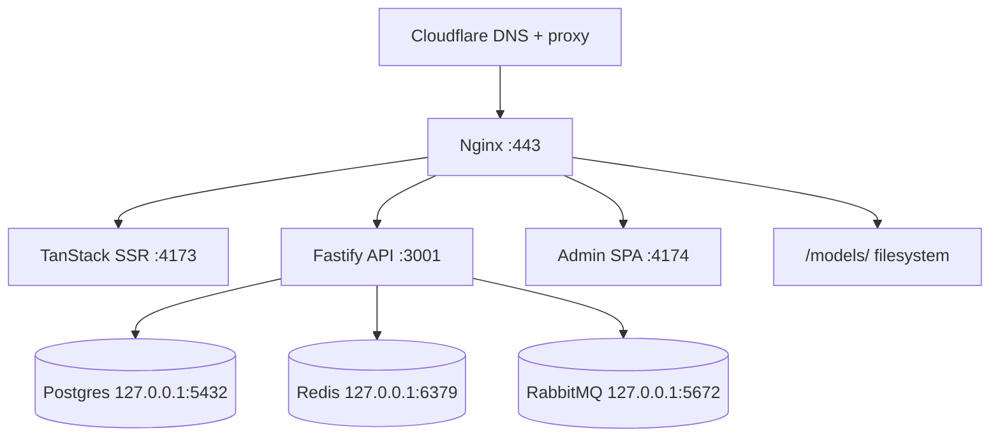

# VPS provisioning (Hostinger 16 GB)

> **Target:** single VPS at `YOUR_VPS_IP` — PM2 for Node, Docker Compose for data layer (optional native Postgres/Redis).
> **Not used:** Kubernetes on one node (control-plane overhead ~500 MB–1 GB). See [kubernetes.md](kubernetes.md).

## Architecture (efficient default)



| Layer | Tool | Why |
|-------|------|-----|
| Edge DNS / CDN | Cloudflare (free) | DDoS, caching, flexible SSL |
| TLS termination | Nginx + Let's Encrypt | On-box certs; Cloudflare Full (strict) |
| App runtime | PM2 cluster/fork | Low overhead vs K8s on 16 GB |
| Data | Docker Compose prod **or** native packages | Compose simplifies upgrades |

## Phase 1 — Local secrets (your machine)

```bash
# 1. SSH deploy key
mkdir -p production/ssh
ssh-keygen -t ed25519 -f production/ssh/id_ed25519_print3d -C "print3d-deploy" -N ""
chmod 600 production/ssh/id_ed25519_print3d

# 2. Production env from templates
chmod +x infra/scripts/*.sh
./infra/scripts/generate-secrets.sh

# 3. Edit domain + WhatsApp (replace yourdomain.com.br)
$EDITOR production/env/api.env production/env/web.env.production production/env/admin.env production/vps.env
```

Set in `production/env/api.env`:

- `CORS_ORIGIN=https://yourdomain.com.br`
- `MODEL_FILES_BASE_URL=https://yourdomain.com.br/models`
- `ADMIN_ORIGIN=https://admin.yourdomain.com.br`
- `WHATSAPP_PHONE_NUMBER=` your shop number

Mirror URLs in `web.env.production` and `admin.env`.

## Phase 2 — Cloudflare

Full steps: [cloudflare-dns.md](cloudflare-dns.md). **Live example:** [corvo3d.com.br](https://corvo3d.com.br) — [shared-vps-multi-domain.md](shared-vps-multi-domain.md) when the VPS already hosts another domain.

Summary:

1. Add site in Cloudflare → copy the two nameservers.
2. At **Registro.br** → domain → **Alterar servidores DNS** → paste Cloudflare NS.
3. Cloudflare DNS records:

| Type | Name | Content | Proxy |
|------|------|---------|-------|
| A | `@` | `YOUR_VPS_IP` | Proxied (orange) |
| A | `www` | `YOUR_VPS_IP` | Proxied |
| A | `admin` | `YOUR_VPS_IP` | Proxied |

4. SSL/TLS → **Full (strict)** after certbot on VPS.
5. Always Use HTTPS: **On**.

## Phase 3 — VPS access

Install your public key on the server (Hostinger panel or):

```bash
ssh-copy-id -i production/ssh/id_ed25519_print3d.pub -p 22 root@YOUR_VPS_IP
ssh -i production/ssh/id_ed25519_print3d root@YOUR_VPS_IP
```

## Phase 4 — Clone and bootstrap (on VPS)

```bash
git clone <your-repo-url> /var/www/print3d
cd /var/www/print3d
DOMAIN=yourdomain.com.br ./infra/scripts/bootstrap-vps.sh
```

## Phase 5 — Push secrets from local machine

```bash
./infra/scripts/sync-to-vps.sh
```

## Phase 6 — First deploy (on VPS)

```bash
cd /var/www/print3d
DOMAIN=yourdomain.com.br ./infra/scripts/first-deploy.sh
certbot --nginx -d yourdomain.com.br -d www.yourdomain.com.br -d admin.yourdomain.com.br
```

## Phase 7 — Manual verification

| Check | Command / URL |
|-------|----------------|
| API health | `curl -sS https://yourdomain.com.br/api/v1/categories` |
| Storefront | Open `https://yourdomain.com.br` — catalog loads |
| Admin login | `https://admin.yourdomain.com.br/login` |
| Models static | `curl -I https://yourdomain.com.br/models/` |
| PM2 | `pm2 status` — `print3d-api`, `print3d-web`, `print3d-admin` online |
| Docker data | `docker compose -f infra/docker-compose.prod.yml ps` |

**Production admin:** bootstrap env vars are disabled when `NODE_ENV=production` ([ADR 001](../adr/001-admin-authentication.md)). Create the first admin on the VPS:

```bash
cd /var/www/print3d/apps/api
CREATE_ADMIN_EMAIL=you@example.com CREATE_ADMIN_PASSWORD='your-secure-password-12+' \
  pnpm run db:create-admin
```

Password reset (user already exists):

```bash
CREATE_ADMIN_FORCE=1 CREATE_ADMIN_EMAIL=you@example.com CREATE_ADMIN_PASSWORD='new-password-12+' \
  pnpm run db:create-admin
```

Then log in at `/admin/login`. Do not use dev credentials (`admin@test.local`) unless you created that user with the command above.

## Ongoing deploys

```bash
# On VPS after git push to main (or CI deploy job):
./infra/scripts/deploy.sh
```

From local — sync secrets only when they change:

```bash
./infra/scripts/sync-to-vps.sh
```

## GitHub Actions secrets

| Secret | Value |
|--------|-------|
| `VPS_HOST` | `YOUR_VPS_IP` |
| `VPS_USER` | `root` |
| `VPS_SSH_KEY` | contents of `production/ssh/id_ed25519_print3d` |

## Related

- [cloudflare-dns.md](cloudflare-dns.md)
- [deployment.md](deployment.md)
- [docker-compose.md](docker-compose.md)
- [kubernetes.md](kubernetes.md)
- [../../production/README.md](../../production/README.md)
